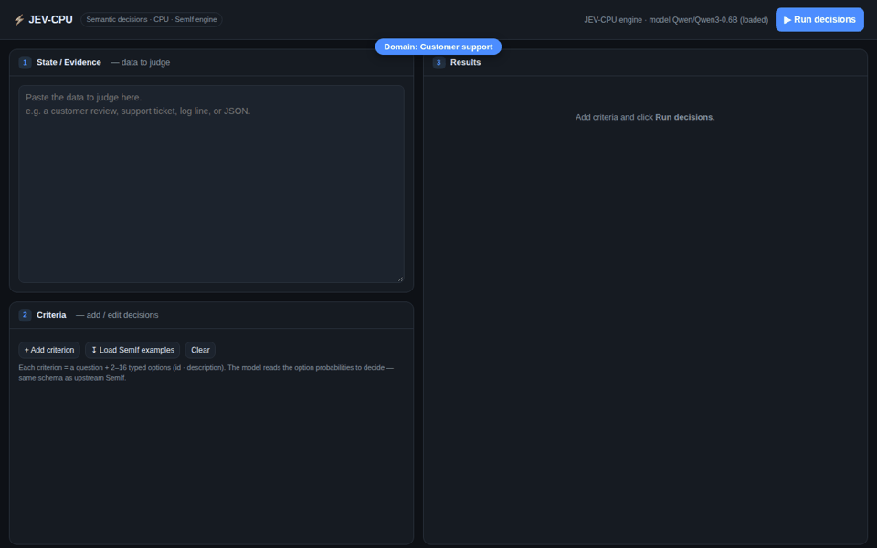
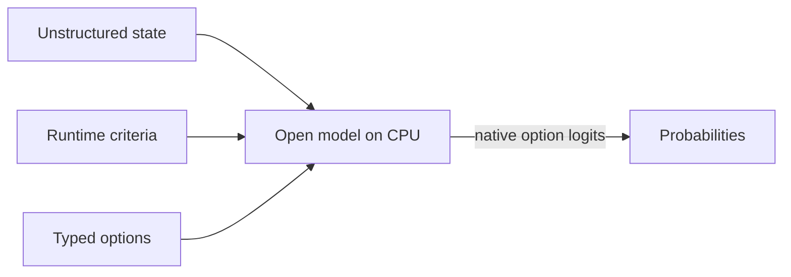
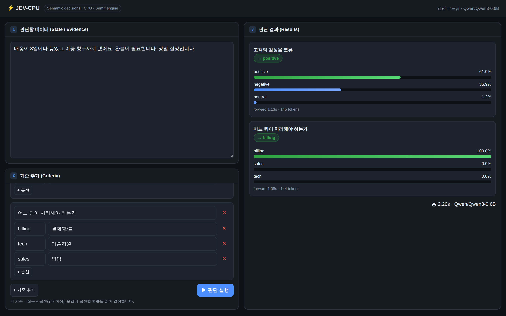
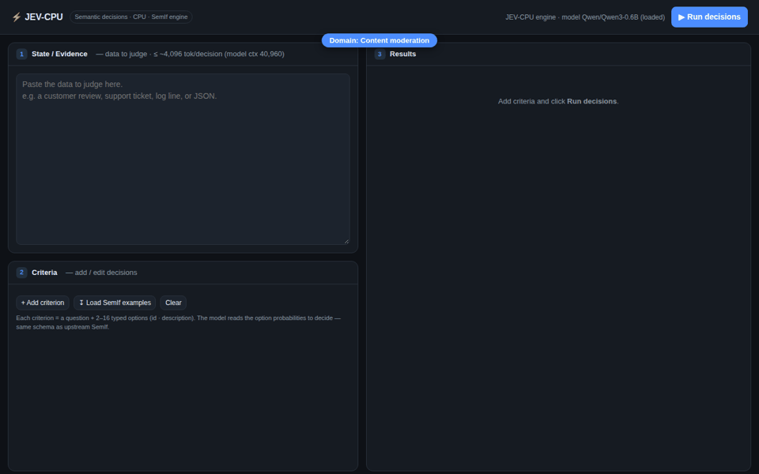
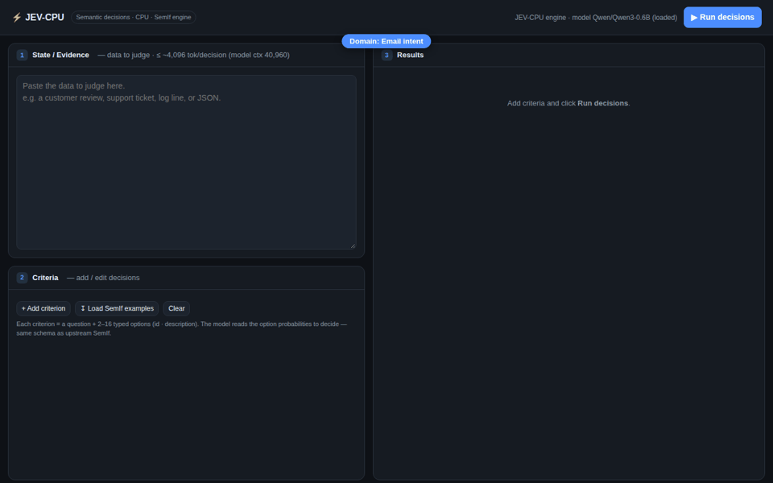
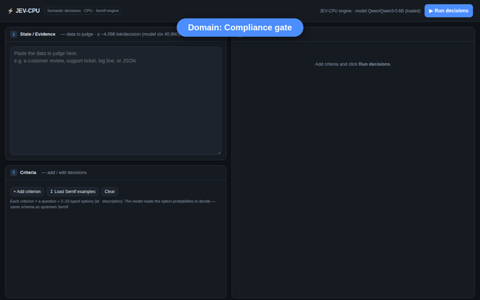

# JEV-CPU

<div align="center">

**Semantic ifs from open models — on a laptop CPU, no GPU.**

*A CPU port of [SemIf](https://github.com/TheoLeeCJ/SemIf) (formerly OpenJev), with a web UI.*

[](https://leesk212.github.io/JEV-CPU/)
[](https://github.com/leesk212/JEV-CPU)
[](https://huggingface.co/Meanblock/JEV-CPU)
[](./LICENSE)

📄 **[Read the full technical report →](https://leesk212.github.io/JEV-CPU/)** · [Run it locally](#quick-start) · [How it works](#how-a-decision-is-read-from-logits) · [Web UI](#web-ui)



*Live PoC — the state is **typed in**, criteria are added, and the decision is read from `Qwen3-0.6B`'s option logits in ~1 s (no text generated). One CPU engine across **eight domains**: support, content moderation, code-review triage, incident severity, email intent, compliance, loan/credit risk, and support prioritization.*

</div>

> **Independent project.** JEV-CPU is a thin CPU adaptation of [TheoLeeCJ/SemIf](https://github.com/TheoLeeCJ/SemIf). It is not affiliated with or endorsed by SemIf's author, TypeSafe, or Jev. Jev, TypeSafe, and other names and marks are the property of their respective owners. No infringement is intended.

Most agent decisions are small: *route this*, *retry that*, *does the evidence support X?* SemIf answers them by reading **typed option probabilities directly from a model** — no answer sentence, no JSON repair, no decoding loop. The upstream project targets a CUDA GPU holding a 4B BF16 model.

**JEV-CPU runs the exact same engine on a CPU**, with a small model and a browser UI, so you can try the pattern on any machine — no GPU, no waitlist.

---

## Why it runs on CPU

SemIf forces a GPU in exactly **one place** — `src/semif_phase1/core.py` → `load_causal_model()`:

```python
if not torch.cuda.is_available() or torch.cuda.device_count() != 1:
    raise ValueError("Expose exactly one CUDA GPU ...")
...
dtype=torch.bfloat16, device_map={"": "cuda:0"}   # ← GPU pinned
```

Everything downstream is **device-agnostic**:

- `direct.py` / `shared.py` follow `device = next(model.parameters()).device`
- `torch.cuda.synchronize` is called **only** when `device.type == "cuda"` (a no-op on CPU)
- option-logit slot extraction and softmax are pure math

So JEV-CPU only swaps the loader (`semif_cpu.py`, CPU + `float32`) and reuses SemIf's **original, unmodified** scoring code.



- **Runtime-defined:** criteria and option descriptions arrive with the request.
- **Decision-native:** one forward pass reads declared option logits; no answer token is sampled.
- **No GPU:** loads `Qwen/Qwen3-0.6B` in `float32` (~2.4 GB) on CPU.

---

## How a decision is read from logits

This is the core idea, and it is why decisions are fast and cheap on a CPU: **the model never generates the answer — JEV-CPU reads it straight out of a single forward pass.** Below is the exact `direct` path (`src/semif_phase1/direct.py` + `core.py`), unchanged from upstream SemIf.

**1. Turn the decision into a letter-choice prompt.**
Each option is assigned an uppercase letter (`A`, `B`, `C`, …). The request becomes one chat turn:

```
system: Apply the supplied criterion to the supplied evidence. Choose exactly
        one listed option. Respond with only its uppercase letter, with no
        explanation or reasoning.
user:   {"evidence": <state>,
         "criterion": <question>,
         "options": [{"letter": "A", "description": "..."},
                     {"letter": "B", "description": "..."}, ...]}
```

The chat template is applied with `add_generation_prompt=True` and `enable_thinking=False`, so the very next token the model would emit is the answer letter.

**2. Pin each option to exactly one token.**
For every letter, `_slot_ids()` checks that the letter encodes to a **single token** that round-trips (`decode(encode("A")) == "A"`), and that appending it to the prompt does not change the prompt's tokenization. This guarantees each option maps to one clean, comparable vocabulary slot — no multi-token drift, no whitespace merges.

**3. One forward pass — no decoding loop.**
The prompt is run through the model **once**. We take the logits at the final position only — the distribution over the *next* token:

```python
logits = model(**inputs, use_cache=False).logits[:, -1, :]   # (vocab,)
```

No sampling, no `.generate()`, no answer sentence, no JSON to repair.

**4. Keep only the option slots, then softmax.**
From that full-vocabulary logit vector we gather just the option-letter token ids and softmax **over those slots alone**:

```python
selected = logits[slot_ids]          # e.g. logits at tokens A, B, C
probs    = softmax(selected)         # conditional distribution over the options
winner   = options[argmax(probs)]
```

The result is a probability per option, **conditional on the declared option set** — reported by JEV-CPU as `option_logits` + `probabilities`. Because it is one forward pass reading fixed positions, latency is dominated by prefill, not by generation length.

> **Why it is device-agnostic:** every step above is `device = next(model.parameters()).device`; the only CUDA-specific call in the whole path is `torch.cuda.synchronize()`, guarded by `if device.type == "cuda"`. On CPU it is simply skipped — so the *same* code runs unchanged.

### Reusing one state across many criteria (`shared` mode)

When every criterion judges the **same** state, `shared.py` prefills that state once into a native KV cache, replicates the cache across branches (`reorder_cache`), and evaluates all criteria's option positions in one batched forward using `logits_to_keep`. One expensive prefill, many cheap decisions — see upstream SemIf's speed tables. JEV-CPU inherits this path as-is (CPU just runs it without the CUDA sync).

---

## Quick start

Python 3.10+, ~3 GB RAM, no GPU:

```bash
python3 -m venv .venv && source .venv/bin/activate   # Debian/Ubuntu: apt install python3-venv
pip install --index-url https://download.pytorch.org/whl/cpu torch
pip install transformers accelerate

# 1) CLI demo — prints typed option probabilities (semantic if)
python semif_cpu.py

# 2) Web UI — http://localhost:8080  (binds 0.0.0.0)
python server.py
```

The first run downloads `Qwen/Qwen3-0.6B` from Hugging Face and loads it on CPU (≈ 5–17 s). The model is loaded once and reused across requests.

---

## Web UI



`server.py` is a dependency-free (standard-library) web server on **port 8080**, laid out in three panes:

```
┌────────────────────────┬───────────────────────────┐
│ ① State / Evidence     │                           │
│   (data to judge)      │   ③ Results               │
├────────────────────────┤   per-option probability  │
│ ② Criteria             │   bars + chosen option    │
│   (add question+options)│                          │
└────────────────────────┴───────────────────────────┘
```

- **① State** — the data to judge: a review, ticket, log line, or JSON blob.
- **② Criteria** — add questions, each with two or more typed options, at runtime.
- **③ Results** — for every criterion, the option probabilities the model read, and the winning choice.

### API

```
GET  /api/health
POST /api/decide
     { "state": "...", "criteria": [ { "id", "question", "options": [ {"id","description"}, ... ] } ] }
```

---

## Verified results (CPU · Qwen3-0.6B · float32)

These are decisions from the demo GIF above — one CPU engine, eight domains:

| Domain | Criterion | Decision | Forward |
|---|---|---|---:|
| Customer support | Sentiment | **negative — 97.4%** ✅ | ~1.1 s |
| Customer support | Route to team | **billing — 100%** ✅ | ~1.0 s |
| Content moderation | Policy violation? | **violation — 99.3%** ✅ | ~1.1 s |
| Content moderation | Recommended action | **warn — 69.2%** ✅ | ~1.0 s |
| Code-review triage | Merge risk | **high — 99.8%** ✅ | ~1.2 s |
| Code-review triage | PR disposition | **block — 94.9%** ✅ | ~1.1 s |
| Incident / DevOps | Severity | **sev1 — 100%** ✅ | ~1.2 s |
| Incident / DevOps | Page on-call now? | **page_now — 100%** ✅ | ~1.1 s |
| Email intent | Primary intent | **sales — 100%** ✅ | ~1.2 s |
| Compliance gate | Change ticket required? | **required — 100%** ✅ | ~1.1 s |
| Loan / credit risk | Credit risk | **high — 100%** ✅ | ~1.2 s |
| Loan / credit risk | Recommended decision | **approve — 82.8%** ⚠️ | ~1.1 s |
| Support prioritization | Priority | **p1 — 100%** ✅ | ~1.2 s |

- Model load ≈ 5–17 s; each decision ≈ **1 s** on CPU (no text is generated).
- Because SemIf reads option logits instead of decoding tokens, CPU latency stays low.
- ⚠️ The loan **decision** row is a small-model slip: `Qwen3-0.6B` correctly flags *high risk* but still leans *approve* — an inconsistency that larger models resolve (see **[Scaling up](#scaling-up-the-brain-model)**).

### Per-domain demos (click to expand)

Each clip types the state in live, adds the criteria, and reads the decision from logits — on CPU.

<details>
<summary><b>🎧 Customer support</b> — sentiment + team routing</summary>


</details>

<details>
<summary><b>🛡️ Content moderation</b> — policy violation + action</summary>


</details>

<details>
<summary><b>🔀 Code-review triage</b> — merge risk + PR disposition</summary>


</details>

<details>
<summary><b>🚨 Incident / DevOps</b> — severity + page on-call</summary>


</details>

<details>
<summary><b>📧 Email intent</b> — intent classification</summary>


</details>

<details>
<summary><b>📋 Compliance gate</b> — change-ticket requirement</summary>


</details>

<details>
<summary><b>💳 Loan / credit risk</b> — risk + recommended decision</summary>


</details>

<details>
<summary><b>⏱️ Support prioritization</b> — ticket priority</summary>


</details>

---

## Scaling up the brain model

The decisions above run on `Qwen/Qwen3-0.6B` — the **smallest** model on SemIf's ladder, chosen so it fits in CPU RAM. It is the accuracy floor, not the ceiling. From SemIf's own evaluation:

| Brain model | Size | Authored balanced accuracy | TypeSafe subset agreement |
|---|---:|---:|---:|
| **Qwen3-0.6B** (JEV-CPU default) | 0.6 B | 0.440 | 0.407 |
| MiniCPM5-2B | 2 B | 0.686 | 0.637 |
| **Qwen3.5-4B** | 4 B | **0.813** | **0.845** |

**Swapping the brain is a one-line change** — set `MODEL` in `semif_cpu.py`; the JEV-CPU engine and web UI are model-agnostic:

```python
MODEL = "openbmb/MiniCPM5-2B"   # or "Qwen/Qwen3.5-4B"
```

That is exactly what fixes the slip in the loan demo: `Qwen3-0.6B` flags *high risk* correctly but still leans *approve*; a 2B/4B brain keeps the secondary decision consistent. The trade-off is resources — a 4B model needs `transformers`' native Qwen3.5 support and more RAM/compute than this 8 GB CPU box; a GPU (SemIf's target) makes it comfortable.

**Takeaway:** JEV-CPU shows the method runs anywhere; **accuracy scales with the model you point it at.**

---

## Input token limits

Two different numbers matter — and the smaller one is **not** a limit of the small model:

| Limit | Value | What it is |
|---|---:|---|
| Model context (`Qwen3-0.6B`) | **40,960 tokens** | The model's architectural window — large even at 0.6 B; context length comes from RoPE, independent of parameter count. |
| JEV-CPU / SemIf default cap | **4,096 tokens / decision** | A safety guard (`max_tokens`); over-long prompts raise instead of being silently truncated. Configurable. |
| Practical max on this 8 GB CPU box | **≈ 7,700 tokens (~117 s)** | Where CPU **prefill latency** becomes the ceiling. Beyond this a single decision crosses **~120 s**, which we treat as impractical — not a memory or model limit. |

**Measured on this 8 GB CPU box** (no GPU), one decision, growing input:

| Input tokens | Forward (CPU) | Peak RAM |
|---:|---:|---:|
| 254 | 2.5 s | ~3.5 GB |
| 731 | 5.6 s | ~3.5 GB |
| 1,363 | 11.9 s | ~3.5 GB |
| 2,629 | 26.0 s | ~3.5 GB |
| 5,165 | 66.1 s | ~3.5 GB |
| 7,697 | 117.4 s | ~3.5 GB |

RAM stayed **flat at ~3.5 GB** even at 7,697 tokens — well past the 4,096 default and with no OOM — so on this box the ceiling is **prefill latency (≈ quadratic)**, not memory or the model. We cap the **practical input at ≈ 7,700 tokens (~117 s)**: past that, one decision exceeds **~120 s**, which is no longer useful on CPU, so larger inputs are treated as unsupported here. Interactive ~1 s decisions want short states (≲ ~300 tokens). A GPU removes this latency wall entirely — where much larger inputs (up to the model's 40,960) become usable again.

Raising the cap is a parameter, not a rebuild: pass a larger `max_tokens` to `direct_score(...)` (or `--max-tokens` in upstream SemIf's CLI). The model accepts input up to 40,960 tokens; on **CPU** the real constraint is prefill time — latency grows with length, so short states keep decisions near ~1 s.

---

## Input

```json
{
  "id": "route-1",
  "state": "Customer cannot access an account after a password reset.",
  "question": "Which queue should handle this request?",
  "options": [
    {"id": "access",  "description": "Account access support."},
    {"id": "billing", "description": "Billing support."}
  ]
}
```

Returned probabilities are conditional on the supplied options — calibrate them on your workload. `state` may also be a nonempty JSON object or array.

---

## What's in this repo

| Path | Description |
|---|---|
| `semif_cpu.py` | CPU/`float32` loader shim + `direct.score()` example. Auto-detects SemIf source (`SEMIF_DIR` env → repo `./src` → `/tmp/SemIf`). |
| `server.py` | Standard-library web server (port 8080) + three-pane UI. |
| `src/semif_phase1/` | Upstream SemIf engine, **unchanged**. |
| `README.SemIf-upstream.md` | Original SemIf README. |

---

## Credits & license

- Engine: **[TheoLeeCJ/SemIf](https://github.com/TheoLeeCJ/SemIf)** — *"Semantic ifs from open models."* Browser demo: <https://openjev.com/>
- Interface concept: TypeSafe's *Jev* pattern.
- Baseline model: [Qwen/Qwen3-0.6B](https://huggingface.co/Qwen/Qwen3-0.6B).

JEV-CPU adds only a CPU loader shim and a web UI on top of SemIf; the scoring logic is unchanged. Upstream models retain their licenses; see [`THIRD_PARTY.md`](./THIRD_PARTY.md). Project code is released under the [MIT License](./LICENSE).
